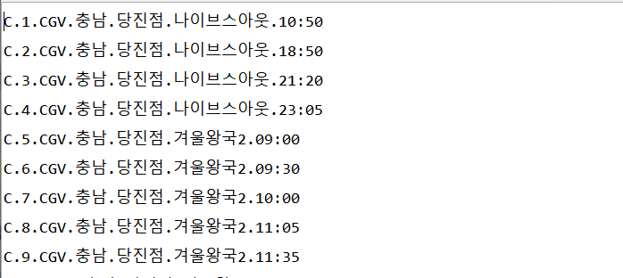
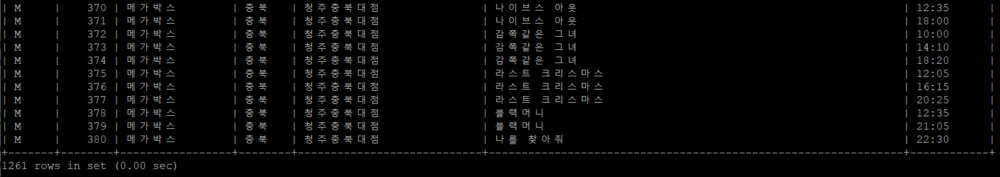
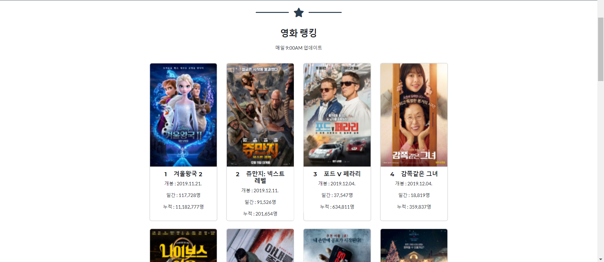

"ONE CLICK MOVIE"
=========
- ### 프로젝트 내용
  ```
  * 자신이 원하는 시간대의 영화가 언제, 어디서 상영하는지 한 눈에 볼 수 있다.
  * CGV, 롯데시네마, 메가박스에서 충청/ 대전/ 세종 지역에서의 각 지점별 영화 시간을 보여준다.
  ```
- ### 프로젝트 설명
  ```
  이 프로젝트는 자신이 원하는 시간대의 영화가 언제, 어디서 상영하는지 한 눈에 볼 수 있어 
  그 동안 영화시간을 찾아 여기저기 헤매셨던 당신에게, 편리한 서비스를 제공한다.
  ```
   
- ### 환경설정
  #### 크롬 설치
  ```
  $ apt install python3-selenium
  $ wget -q -O - https://dl-ssl.google.com/linux/linux_signing_key.pub | sudo apt-key add -
  $ sudo sh -c 'echo "deb [arch=amd64] http://dl.google.com/linux/chrome/deb/ stable main" 
    >>         /etc/apt/sources.list.d/google.list'
  $ sudo apt-get update
  $ sudo apt-get install google-chrome-stable
  ```
  #### Chromedriver 설치 및 경로 설정
  ```py
  크롬드라이버 버전이 리눅스에서 설치할 때 맞는 버전을 찾을 수가 없어 
  버전에 맞는 크롬드라이버를 윈도우 에서 다운 받은 다음 WinSCP로 옮겨 주었습니다.
  unzip chromedriver_linux64.zip
  chmod +x chromedriver
  sudo mv -f chromedriver /usr/local/share/chromedriver
  sudo ln -s /usr/local/share/chromedriver /usr/local/bin/chromedriver
  sudo ln -s /usr/local/share/chromedriver /usr/bin/chromedriver
  위 코드들을 실행한 후 Chromedriver 경로
  > /usr/bin/chromedriver
  
  ```
  #### 필요한 패키지
  ```
  from selenium import webdriver
  from selenium.webdriver.chrome.options import Options
  import datetime 
  import re 
  import urllib.request 
  from datetime import datetime, timedelta 
  import threading 
  import time 
  from bs4 import BeautifulSoup

  import matplotlib.pyplot as plt
  from wordcloud import WordCloud, STOPWORDS
  from threading import Thread
  from time import sleep
  
  import jason
  ```

  #### MySQL 테이블 생성
  $mysql -u root -p
  ```sql
  create database movie;
  use movie;

   create table movie(
    mv_id varchar(10) not null,
    mv_num int not null,
    mv_brand varchar(20) ,
    mv_loc varchar(10) ,
    mv_branch varchar(20) ,
    mv_name varchar(100) ,
    mv_time varchar(10) ,
    primary key(mv_id, mv_num)
    );
  ```
  
  - ### 
    #### 영화관 크롤링
    ```
    $ ./ltcgvmegacrawl.py
   
   > timetable.txt  
    ```
    #### timetable.txt에 크롤링 결과 저장
    
    
    ```
    > MySQL -u root -p
    > use movie;
    > LOAD DATA local infile '/home/ubuntu/project/CloudComputing/CloudComputing/integration/timetable.txt'
      into table movie fields terminated by '.';
      
      위의 과정으로 LOAD DATA시도했을 때 실패했을 시
      1) ERROR 1148 (42000): The used command is not allowed with this MySQL version 라는 오류 발생시 해결방법 
       1. mysql 접속시 --local-infile=1 옵션 추가
       mysql -u root -p --local-infile=1 database
       2.  local 키워드 제외
       $ mysql>LOAD DATA INFILE 'test.csv' INTO TABLE tablename FIELDS TERMINATED BY ','; 
       3. my.cnf 설정 변경
       [mysql]
       local-infile=1
       출처: https://gomi97.tistory.com/1104 [사랑하기 좋은 시절에 맘껏 사랑하라.]
      
      2) The MySQL server is running with the --secure-file-priv option so it cannot execute this statement 
       오류 발생시 해결방법
       1. secure_file_priv 설정을 바꿔준다.
       $ vim /etc/mysql/my.cnf
       위의 경로로 들어가서
       [mysqld]
       secure-file-priv=""
       를 입력하고 저장한 뒤, 아래 명령으로 MySQL을 재시작한다.
       $ service mysql restart
      
       출처: https://sssunho.tistory.com/56 [개발자 수노]
    ```
    #### movie 테이블에 timetable.txt 로드
    
    
    #### php에서 json 파일을 읽어 사용을 위한 배열처리
    ```php
    <?php
    $json_string = file_get_contents('movie_ranking.json'); //'json파일명'.json
    $R=json_decode($json_string,true);
    ?>
    ```
    
    #### ubuntu 에서 php를 통한 mysql DB 연동
    ```php
    <?php
    $servername = "<퍼블릭IP주소>";
      $username = "root";
      $password = "<사용자PW>";
      $dbname = "<스키마이름>";
      $port = "8000"; //Mysql 포트 번호 설정

      //create connection
      $conn = new mysqli($servername, $username, $password, $dbname, $port);  
      //ubuntu에서 외부접근 허용을 위해 $servername과 $port 추가 필요

      //check connection
      if($conn -> connect_error){
         die("Connection failed : " + $conn -> connect_error);
      }
      mysqli_select_db($conn, $dbname) or die('DB selection failed');
      ?>
    ```
    
 - ### 사용법
    #### > 영화 랭킹 클릭
    ```
      * 매일 9:00 AM에 업데이트 되는 영화 순위 확인 가능
    ```
     
     
    ####  > 상영 정보 클릭
     ```  
      * 영화 시간표 확인 가능
      * 영화 제목, 지역 선택 
      * 시간순으로 정렬된 영화관 정보 확인 가능 
     ```
    
     
    #### > 영화 핫이슈 클릭
    ```
      * 워드클라우드로 영화관련 이슈 단어 확인 가능
    ```
    #### 실행 
    ```
    최종 URL : http://3.211.18.78/page/projectPage/main.php 
    ```
